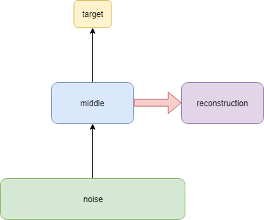
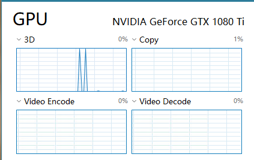

# Deep-Image-Analogy-MXNet
A python implementation of Deep-Image-Analogy based on MXNet.
## Abstract
The main work of this version is to use MXNent to implement Deep Image Ananogy. Although some people have already used pytorch to achieve good results, it is still not easy to rewrite the pytorch program into the MXNet version.
Thanks to Ben-Louis's [Deep-Image-Analogy-PyTorch](https://github.com/Ben-Louis/Deep-Image-Analogy-PyTorch.git) and harveyslash's[Deep-Image-Analogy-PyTorch]( https://github.com/harveyslash/Deep-Image-Analogy-PyTorch.git) Without their work, I will never complete the work. The implementation of Ben-Louis achieved a better visual effect than mine, but my version may be slightly faster (8-10times faster?). Harveyslash gives a CUDA implementation of patch-match.


## Usage:
### Requirements:
1. pycuda (If you are using CUDA8, please do not use the visual  studio version above vs2015), please refer to [PyCUDA installation on Windows](https://github.com/drasmuss/hessianfree/wiki/PyCUDA-installation-on-Windows)and read this document carefully. If you are not familiar with CUDA, it is recommended to take a few minutes to understand it. Note that users of Windows should set the TDR Delay in the option of Nsight Monitor to about **30 seconds**. If your graphics card is poor than mine, it is recommended that you set this time larger or reduce the number of patch-match iterations appropriately. Then you need to reboot your computer.
2. MXNet GPU version. (If you encounter openSSL errors when importing MXNet, please use **pip install -u pyopenssl**. If you encounter pip unsuccessful, please update the pip)
3. vgg19.param file,you can download from [here](https://apache-mxnet.s3-accelerate.dualstack.amazonaws.com/gluon/models/vgg19-f7134366.zip) ,and put it to "model" path.(It's fast)
### Running:
in main.py ,setting "show_step"=0,save file,and
```
python main.py
```
0r
Run ipynb file, ipynb file provides better visualization.
## MXNet & pytorch
The gluon interface of MXNet is actually similar to that of pytorch. MXNet uses NDArray as the carrier for its data operations, and pytorch uses tensor as the basic operation of its operations. Compared with pytorch, MXNet is slightly lacking in the richness of data manipulation. Pytorch is more similar to Numpy for data manipulation, and it is more convenient. But the advantages of MXNet are clearer device management and faster speeds, as well as more friendly operation documentation. (I have to say that Pytorch's documentation really made me a bit confused. I actually got a lot of support from the official documentation when using MXNet.)
However, both MXNet and Pytorch provide dynamic neural network computing, which is important for multiple subnets in the algorithm. It can't be imagined how difficult it would be to do this in a static graph frame such as tensorflow. Thanks to the developer for us to develop so many useful tools, making the implementation of the algorithm easy.
However, the hardest part of the project is not the construction and training of neural networks (well, I admit that I also spent a lot of time changing many parameters during training, tried a lot of error functions, and each All sorts of "smart" ideas) actually spend time on data processing, such as how to upsampling, how to recover images, and so on. Although deep learning has brought us great shocks and made amazing results, we should not forget that basic data manipulation is the hero behind these algorithms.
## Some Details
### Reconstruction
What is different from what is described in https://arxiv.org/abs/1705.01088 is that the network structure in the following figure is used for reconstruction. This structure does make the output image smoother and works well.



 In this implementation, Adam is used instead of the quasi-Newton method, which is slightly less effective than the pytorch version, but faster. (Note that nd.waitall() is a time-consuming operation, but there are some problems if you remove nd.waitall.)
### patch_match
Using cuda accelerated patch is fast, but it also consumes a lot of memory, as shown in the figure, running the patch, the memory usage will suddenly increase, windows users may appear desktop stuck.


### parch reconstruction
As shown, it is the case when patch_size =1


## Acknowledgments
My project acknowledge the Ben-Louis's[Deep-Image-Analogy-PyTorch](https://github.com/Ben-Louis/Deep-Image-Analogy-PyTorch.git)and harveyslash'[Deep-Image-Analogy-PyTorch]( https://github.com/harveyslash/Deep-Image-Analogy-PyTorch.git), thanks for the authors of this amazing algorithm.
