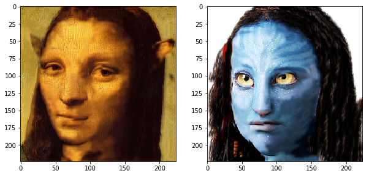
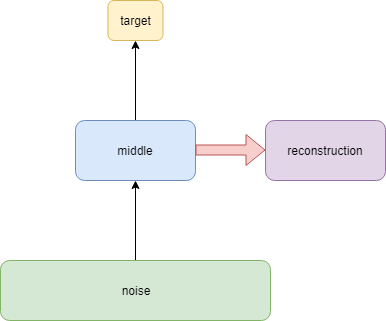
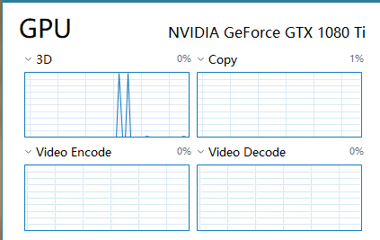

# Deep-Image-Analogy-MXNet
A python implementation of Deep-Image-Analogy based on MXNet.
### Abstract
这个版本的主要工作是使用MXNent来实现Deep Image Ananogy.虽然已经有人使用pytorch已经达到了很好的效果，但是将pytorch的程序改写为MXNet版本的确实还是不简单的。
感谢Ben-Louis的[Deep-Image-Analogy-PyTorch](https://github.com/Ben-Louis/Deep-Image-Analogy-PyTorch.git)以及harveyslash的[Deep-Image-Analogy-PyTorch](https://github.com/harveyslash/Deep-Image-Analogy-PyTorch.git)，没有他们的工作，我是难以实现MXNet版本的Deep-Image-Analogy。Ben-Louis的实现方法比我的实现取得了更好的视觉效果，但是我的版本可能会稍快一点（8-10times faster?）harveyslash给出了patch-match的CUDA实现。


### 使用方法：
#### Requirement：
1. pycuda(如果你使用的是CUDA8，请不要使用vs2015以上的版本)，请参考[PyCUDA installation on Windows](https://github.com/drasmuss/hessianfree/wiki/PyCUDA-installation-on-Windows),请仔细阅读该文档，如果你不熟悉CUDA，建议花几分钟时间了解它。注意，windows的用户应当将Nsight Monitor中option里面的TDR Delay设置为30s左右，如果你的显卡较差，建议你把这个时间设置的大一些，或者是适当减小patch-match的迭代次数。随后需要重启电脑。
2. MXNet GPU 版本。（如果你在导入MXNet的时候遇到了openSSL方面的错误，请使用指令**pip install -u pyopenssl**,如果遇到pip不成功的，请更新一下pip）
3. 请下载vgg19.param 文件，并将其方法哦model文件夹下（下载挺快）
#### Running：
```
python main.py
```
0r
运行ipynb文件,ipynb文件提供了更好的可视化效果，
### MXNet & pytorch
MXNet的gluon接口与pytorch的实际上比较相似，MXNet通过NDArray作为其数据运算的载体，而pytorch使用了tensor来作为其运算的基本操作。与pytorch相比，MXNet在数据操作的丰富程度上稍有欠缺，pytorch对于数据的操作更加接近于Numpy，用起来也更加顺手一些。但是MXNet的优势在于更加清晰的设备管理以及更快的速度，以及更加友好的操作文档。（不得不说，pytorch的文档确实让我有点糊涂，使用MXNet的时候我从其官方文档当中确实得到了很多的支持。）
但是无论MXNet还是pytorch都提供了动态神经网络计算功能，这对于算法中多次的子网络是很重要的。无法想象，在tensorflow这样的静态图框架这样做会多么难受。感谢开发者为我们开发了这么多好用的工具，使得算法的实现变得简单易行。
但是，项目中最难的部分并不是神经网络的搭建以及训练（好吧，我承认我在训练的时候也花了不少的时间换了很多的参数，尝试了很多的误差函数，还有各种各样“聪明的”点子），实际上主要将时间花费在了数据的处理上，比如如何上采样，如何对图像进行恢复等等。深度学习虽然带给我们很大的震撼，做出了令人惊奇的成果，但是我们不应该忘记，基本的数据操作是这些算法背后的英雄。
### Some Details
#### Reconstruction
与https://arxiv.org/abs/1705.01088. 中所述不同的是，重建的时候是采取的是下图中的网络结构，这样的结构确实是使得输出图像更加平滑，效果很好。


 在本实现中，使用的是Adam,而不是拟牛顿法，效果比pytorch版本稍差，但是速度较快。（注意，nd.waitall()是一个比较耗时的操作，但如果去掉nd.waitall 又会有一些问题。）
#### patch_match
使用cuda加速的patch速度很快，但是同时也会消耗掉大量内存，如图所示，运行patch的时候，内存占用率会突然提高，windows用户可能会出现桌面卡死的情况。


#### parch reconstruction
如图所示，是patch_size =1 的时候的情况



### Acknowledgments
My project acknowledge the Ben-Louis's[Deep-Image-Analogy-PyTorch](https://github.com/Ben-Louis/Deep-Image-Analogy-PyTorch.git)and harveyslash'[Deep-Image-Analogy-PyTorch,thanks for the authors of this amazing algorithm.
